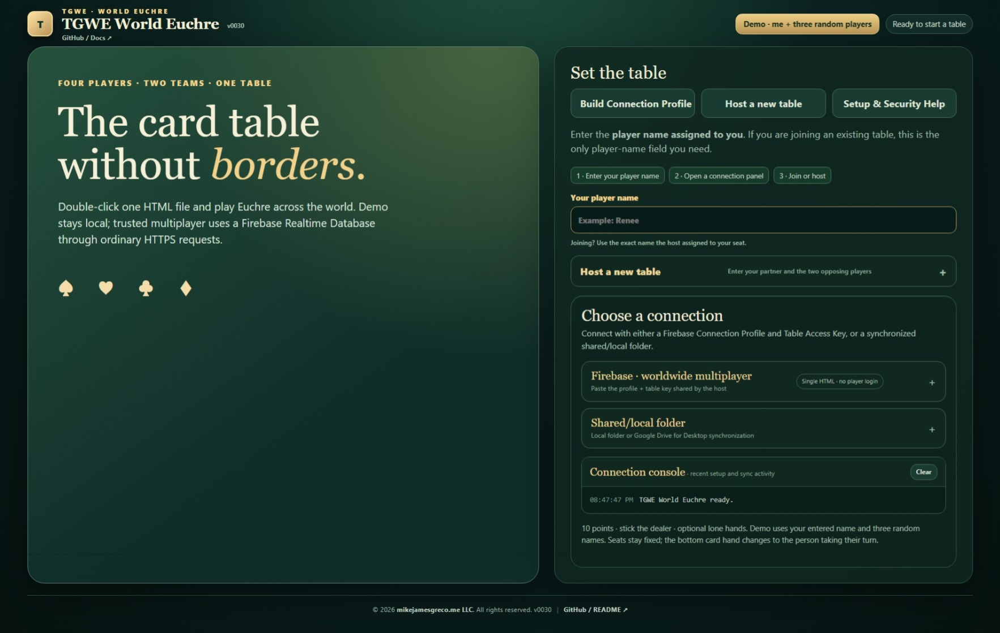

# TGWE World Euchre

**The Greco World Euchre**

A single-file browser Euchre table for four players, designed to work as a local demo, a trusted worldwide multiplayer game through Firebase Realtime Database, or a synchronized shared-folder game.

TGWE World Euchre keeps the application itself in one standalone HTML file. No application server, package manager, framework, or Firebase JavaScript SDK is required at runtime.

> **One HTML file. Four seats. One shared table.**



## Run TGWE World Euchre

**[▶ Run TGWE World Euchre in your browser](https://mikejamesgreco.github.io/tgwe-euchre/)**

Or download `tgwe-euchre.html` and open it directly in a modern browser.

The GitHub Pages launcher in `index.html` redirects directly to the standalone application.

---

## Ways to Play

TGWE supports three modes.

### Local Demo

Use **Demo · me + three random players** to run all four seats in one browser.

This is the fastest way to test bidding, trick order, scoring, dealer rotation, the first-dealer draw, and the user interface without configuring multiplayer.

### Firebase Worldwide Multiplayer

For trusted groups playing from different locations, TGWE can synchronize a table through **Firebase Realtime Database** using native browser HTTPS requests.

The project owner creates the Firebase project once and shares two TGWE values with the four players:

1. **Connection Profile** — identifies the Firebase project configuration.
2. **Table Access Key** — identifies the private game-room path.

Each player also needs the exact player name assigned by the host.

The players do **not** need the Firebase owner's Google password and do not sign into Google through the game page. TGWE uses Firebase Anonymous Authentication for the browser session.

### Shared / Local Folder

TGWE can also store ordinary JSON game files in a folder selected through the browser File System Access API.

This can be useful when all players already have access to a filesystem location synchronized by another service, such as a shared folder exposed locally by desktop synchronization software.

TGWE does not provide the external folder synchronization itself.

---

## Game Flow

A new table is created with four named seats:

```text
             Partner
              North

Opponent West       Opponent East

               You
              South
```

Each player's own seat is visually rotated to the bottom of their screen while the logical North / East / South / West seating remains consistent for the shared game.

### Choosing the First Dealer

A new game begins with a synchronized first-dealer draw.

- North deals the selection cards.
- Cards are revealed face-up clockwise.
- The first **J♣ or J♠** determines the first dealer.
- After the first dealer is selected, Hand 1 begins.
- Dealer rotation then continues clockwise from hand to hand.

### Bidding and Play

TGWE implements the familiar Euchre flow:

- Round one: order up the turned card's suit or pass.
- Round two: call another suit or pass.
- Stick the dealer is enabled.
- Lone hands are supported.
- The left bower counts as trump.
- Players must follow suit when possible.
- The winner of each trick leads the next trick.
- Play proceeds clockwise.

### Scoring

The game target is **10 points**.

Current scoring behavior:

- Calling team wins 3 or 4 tricks: **1 point**
- Calling team sweeps all 5 tricks: **2 points**
- Lone caller sweeps all 5 tricks: **4 points**
- Defenders euchre the calling team: **2 points**

---

## Firebase Setup

The application includes **Setup & Security Help** with the complete first-time walkthrough.

At a high level, the Firebase project owner:

1. Creates a Firebase project on the Spark plan.
2. Creates a Realtime Database.
3. Enables **Anonymous** Authentication.
4. Applies Realtime Database rules that deny broad database access and allow authenticated access under a known game path.
5. Registers a Firebase Web App and obtains the project's Web API Key and Realtime Database URL.
6. Uses **Build Connection Profile** in TGWE to generate a portable Connection Profile.
7. Generates a Table Access Key and creates the four-player table.

TGWE uses the Firebase Web API Key and Realtime Database URL as client configuration. They are not treated as passwords.

The Table Access Key should still be shared only with the trusted players invited to the game.

---

## Joining an Existing Firebase Table

A joining player needs only:

```text
Exact assigned player name
Connection Profile
Table Access Key
```

Then:

1. Open `tgwe-euchre.html`.
2. Enter the assigned player name.
3. Open **Firebase · worldwide multiplayer**.
4. Paste the Connection Profile.
5. Paste the Table Access Key.
6. Choose **Connect Firebase**.

TGWE checks the key automatically. If the table exists and the player name matches a seat, the player joins that seat.

If the key does not identify an existing table, TGWE will not silently create one for a joining player. A new table is created only when the host setup is complete.

---

## Presence and Reconnection

Firebase multiplayer includes a lightweight presence heartbeat.

The roster shows whether each player is currently online and how recently that browser was seen. If a browser closes or loses its connection, its presence ages out after a short timeout.

A player can reconnect to the same game using the same:

- assigned player name
- Connection Profile
- Table Access Key

The game state remains in Firebase independently of any single browser window.

---

## Trusted-Table Security Model

TGWE is designed for a small group of people who trust one another.

The architecture is intentionally lightweight:

```text
Player Browser
     │
     │ HTTPS REST
     ▼
Firebase Authentication
     │
     ▼
Realtime Database
     │
     └── games / <Table Access Key> / ...
```

Important limitations:

- Anonymous Firebase authentication is not a strong real-world identity system.
- A player who has the Connection Profile and Table Access Key can inspect the shared game data available to that browser.
- The current design is not intended to provide anti-cheat guarantees.
- Do not use the table for sensitive information, money, rankings, or adversarial security scenarios.

---

## Single-File Architecture

The playable application is:

```text
tgwe-euchre.html
```

It contains the HTML, CSS, JavaScript game engine, UI, Firebase REST integration, local-folder integration, setup help, and game rules required to run the application.

Firebase multiplayer intentionally communicates with Firebase when used. The local demo requires no backend service.

---

## Repository Structure

The initial repository can stay intentionally small:

```text
tgwe-euchre/
│
├── index.html          # GitHub Pages launcher
├── tgwe-euchre.html    # Standalone TGWE application
├── screenshot.jpeg     # Repository screenshot
└── README.md
```

Additional documentation, tests, release notes, or samples can be added as the project grows.

---

## Browser Support

TGWE is designed for modern desktop browsers.

Firebase mode uses standard browser HTTPS requests and can run from GitHub Pages or from the standalone HTML file.

Shared-folder mode depends on the browser File System Access API, so Chromium-based desktop browsers such as Microsoft Edge and Google Chrome currently provide the most complete support for that mode.

---

## Privacy

The local demo runs entirely in the current browser.

Firebase mode sends the shared game state, table presence, and moves to the Firebase project selected by the project owner.

TGWE does not require a central TGWE account service.

---

## Project Status

TGWE World Euchre is under active development.

The current application includes:

- Four named seats and two teams
- Local demo play
- Firebase worldwide multiplayer
- Shared/local-folder synchronization mode
- Automatic Firebase join/create flow
- Live player presence and reconnect support
- First-black-Jack dealer selection
- Euchre bidding and trump selection
- Lone hands
- Follow-suit enforcement
- Trick capture and trick-winner sequencing
- Dealer rotation
- Scoring to 10
- In-app Firebase setup and security help
- Invite/reconnect details
- Connection console and diagnostics

---

## Repository

Source and documentation:

**https://github.com/mikejamesgreco/tgwe-euchre**

Hosted application:

**https://mikejamesgreco.github.io/tgwe-euchre/**

---

## Copyright

© 2026 **mikejamesgreco.me LLC**. All rights reserved.

---

## Author

**Michael J. Greco**

TGWE World Euchre — **The Greco World Euchre**
